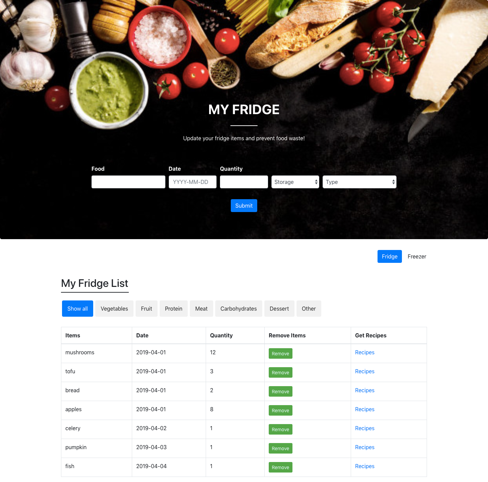
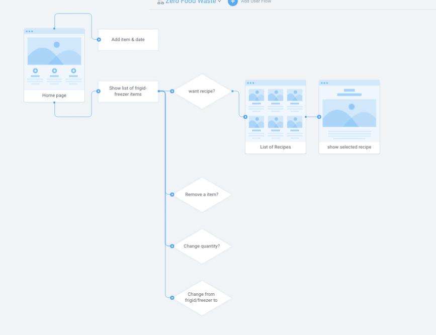
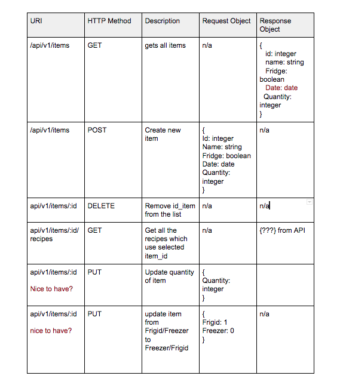
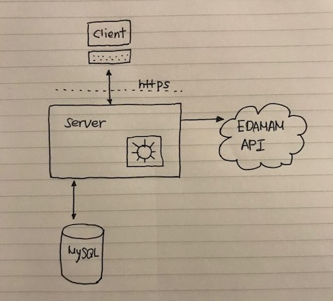

# MY FRIDGE
MyFridge is an app which will help you to avoid food waste from your fridge.

## FEATURES
  - [ ] Principle Features
      - Add item, type, quantity and date to the fridge or freezer
      - Show the list of items in fridge and freezer by date order
      - Sort items by category
      - Show alert when items are close to expiration
      - Can remove item from the fridge or freezer
      - Show possible recipes and can chose one to show detail.em, show possible recipes and can chose one to show detail.

  - [ ] Nice-to-have
    - Update quantity
    - Move an item from fridge/freezer to freezer/fridge
    - show the list with defualt image of each item

## STACK
MyFridge is built using React, Express, Node.js, MySQL and Bootstrap.

## API
[EDAMAM](https://developer.edamam.com/edamam-docs-recipe-api)

## PLAN
  - [ ] User Flow
  
   
   
   
  
  - [ ] Database schema
  
   
   
   
  
  - [ ] API routes plan
  
   
   
   
  
  - [ ] Full stack architecture drawing
  
   

## SETUP

### Dependencies
Run `yarn` to install dependencies.

### Database Prep
- [ ] Create `.env` file in the api directory and add `DB_PASS=YOURPASSWORD` and `DB_NAME=myFridge`.

- [ ] Type `mysql -u root -p -e "create database myFridge"` in your terminal to create a database in MySQL.

- [ ] Type `CREATE TABLE items (id INT(11) NOT NULL AUTO_INCREMENT, name VARCHAR(20) not null, fridge Boolean NOT NULL, date DATE, quantity INT(11), PRIMARY KEY (id));`.It will create a new table name items with columns (id, name, fridge, date, quantity).

### Run Your Start
Run `yarn start` in your terminal .

_This is a student project that was created at [Codely](http://codely.tech), a full stack development bootcamp in Barcelona._

